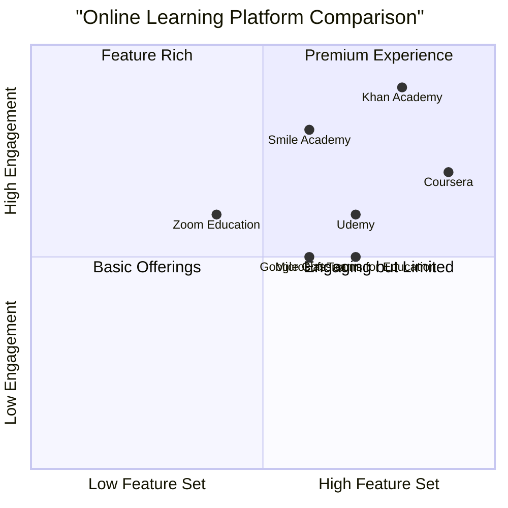

# Smile Academy Online Learning Platform PRD

## 1. Project Overview

### 1.1 Project Information
- Project Name: smile_academy
- Programming Language: React, JavaScript, Tailwind CSS
- Platform Type: Web-based Online Learning Platform

### 1.2 Original Requirements
Create an online school platform called Smile Academy where teachers can run their virtual classrooms and students can learn from home. The platform should support multiple subjects including mathematics, English language, sciences, and other relevant subjects.

## 2. Product Definition

### 2.1 Product Goals
1. Create a comprehensive virtual learning environment that enables teachers to easily manage and deliver online education
2. Provide an engaging and interactive learning experience for students learning from home
3. Build a scalable platform that supports multiple subjects and teaching methodologies

### 2.2 User Stories

#### Teachers
- As a teacher, I want to create and manage virtual classrooms so that I can teach multiple subjects to different groups of students
- As a teacher, I want to upload and organize learning materials so that students can access them easily
- As a teacher, I want to track student progress and generate performance reports so that I can provide targeted support

#### Students
- As a student, I want to access all my courses and learning materials in one place so that I can learn efficiently
- As a student, I want to interact with teachers and classmates during live sessions so that I can get immediate feedback

#### Parents
- As a parent, I want to monitor my child's progress so that I can support their learning journey

### 2.3 Competitive Analysis

#### Market Analysis



#### Competitor Analysis

1. Khan Academy
- Pros:
  * Free, high-quality educational content
  * Comprehensive analytics and progress tracking
  * Gamified learning experience
- Cons:
  * Limited live interaction features
  * No direct teacher-student relationship
  * Fixed curriculum structure

2. Coursera
- Pros:
  * University-level content
  * Professional certification programs
  * High-quality video production
- Cons:
  * Higher price point
  * Not focused on K-12 education
  * Limited real-time interaction

3. Google Classroom
- Pros:
  * Easy integration with Google Workspace
  * Simple user interface
  * Free for educational institutions
- Cons:
  * Limited specialized learning features
  * Basic assessment tools
  * Dependency on Google ecosystem

4. Zoom Education
- Pros:
  * Excellent video conferencing capabilities
  * Breakout rooms for group activities
  * Widespread adoption
- Cons:
  * Limited learning management features
  * No built-in curriculum tools
  * Security concerns

5. Microsoft Teams for Education
- Pros:
  * Comprehensive collaboration tools
  * Integration with Office 365
  * Strong security features
- Cons:
  * Complex interface
  * Steep learning curve
  * Limited specialized education features

## 3. Technical Specifications

### 3.1 Requirements Analysis

The platform requires a robust web-based solution that supports:
- Real-time video conferencing
- Content management system
- User management and authentication
- Progress tracking and analytics
- Interactive learning tools
- Mobile responsiveness

### 3.2 Requirements Pool

#### P0 (Must-have)
1. User Management
   - Teacher and student registration
   - Profile management
   - Role-based access control

2. Virtual Classroom
   - Live video conferencing
   - Screen sharing
   - Interactive whiteboard
   - Chat functionality

3. Content Management
   - Course creation and organization
   - Learning material upload (documents, videos, presentations)
   - Assignment management
   - Resource library

4. Assessment Tools
   - Quiz creation and management
   - Assignment submission
   - Automated grading
   - Progress tracking

#### P1 (Should-have)
1. Analytics Dashboard
   - Student performance metrics
   - Attendance tracking
   - Engagement analytics
   - Progress reports

2. Communication Tools
   - Internal messaging system
   - Announcement board
   - Parent communication portal
   - Discussion forums

3. Collaboration Features
   - Group projects
   - Peer review system
   - Breakout rooms
   - Shared documents

#### P2 (Nice-to-have)
1. Advanced Features
   - AI-powered learning recommendations
   - Gamification elements
   - Virtual labs
   - Mobile app

2. Integration Capabilities
   - Third-party tool integration
   - Learning content marketplace
   - Payment gateway
   - Calendar synchronization

### 3.3 UI Design Draft

Key Interfaces:

1. Dashboard
```
+------------------+------------------+
|   Navigation     |  Quick Stats     |
+------------------+------------------+
|                  |                  |
|   Upcoming       |  Recent          |
|   Classes        |  Activities      |
|                  |                  |
+------------------+------------------+
|   Course         |  Progress        |
|   Overview       |  Tracking        |
|                  |                  |
+------------------+------------------+
```

2. Virtual Classroom
```
+------------------+------------------+
|   Video Area     |  Participant     |
|                  |  List           |
|                  |                  |
+------------------+------------------+
|   Whiteboard     |  Chat           |
|   /Screen Share  |  Area           |
|                  |                  |
+------------------+------------------+
|   Controls (Mic, Camera, Share)    |
+-----------------------------------+
```

### 3.4 Open Questions

1. Technical Infrastructure
   - What is the expected initial user base?
   - What are the scalability requirements?
   - What are the data retention policies?

2. Content Management
   - What file types need to be supported?
   - Are there storage limits per teacher/course?
   - How will content moderation be handled?

3. Integration Requirements
   - What third-party tools need to be integrated?
   - Are there specific security compliance requirements?
   - What payment systems should be supported?

4. Support and Maintenance
   - What level of technical support will be provided?
   - How will system updates be managed?
   - What is the backup and recovery strategy?

## 4. Success Metrics

1. User Engagement
   - Daily active users
   - Average session duration
   - Course completion rates

2. Technical Performance
   - System uptime
   - Video streaming quality
   - Page load times

3. Business Metrics
   - User growth rate
   - Teacher retention rate
   - Student satisfaction scores

## 5. Timeline and Phases

### Phase 1 (MVP) - 3 months
- Core user management
- Basic virtual classroom
- Essential content management
- Basic assessment tools

### Phase 2 - 3 months
- Analytics dashboard
- Advanced communication tools
- Collaboration features
- Enhanced assessment capabilities

### Phase 3 - 4 months
- AI features
- Mobile app
- Integration capabilities
- Advanced features and optimizations